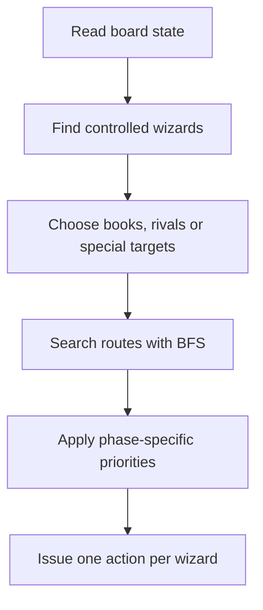

# 🧙 Autonomous Game Agent


[](https://github.com/Gen765/harry-potter-autonomous-game-agent/actions/workflows/build-and-test.yml)


This is my C++ player for the FIB-UPC EDA strategy-game tournament. Each round
it controls a group of wizards on a grid, choosing between collecting books,
converting rivals, helping allies and preparing spells.

## 👨‍💻 My contribution

My tournament player is implemented in [`AIGen7.cc`](AIGen7.cc). I worked on
its target selection, pathfinding and phase-specific rules, then added scripts
to repeat matches over different seeds and starting positions.

The repository also contains the course engine, replay viewer and three
baseline players required to run local matches. Those parts are identified in
[`THIRD_PARTY_NOTICES.md`](THIRD_PARTY_NOTICES.md).

## 🧠 Agent strategy



`Gen765` combines several small rule-based decisions rather than one global
search:

- BFS pathfinding towards books and capturable enemy wizards;
- per-wizard target selection and movement;
- special handling for conversion, ghosts and spell ingredients; and
- fallback rules when a preferred target or route is unavailable.

The code keeps the shape of the original tournament entry—large decision
functions, Spanish helper names and plenty of heuristics. A shorter walkthrough
is available in [`docs/strategy.md`](docs/strategy.md).

## 🏆 Local results

The recorded evaluation uses ten seeds and rotates every player through each
starting position, for a total of 40 matches.

| Player | Wins | Mean score |
| --- | ---: | ---: |
| `Gen765` | 40 / 40 | 10,551.23 |
| `Basic_player` | 0 / 40 | 5,908.60 |
| `Demo` | 0 / 40 | 1,420.60 |
| `Null` | 0 / 40 | 720.48 |

These are local baseline matches, not an official tournament ranking. The
breakdown by seed and starting position is in
[`docs/tournament-summary.md`](docs/tournament-summary.md), with the source rows
in [`docs/tournament-results.csv`](docs/tournament-results.csv).

## 🎬 Replay viewer

Tournament runs produce `.res` replay files. Prepare one for the bundled HTML
viewer with:

```sh
python3 scripts/prepare_viewer.py --input output/tournament/seed01-rot0.res
```

Then open `Viewer/viewer.html` and load the prepared replay.

## 🚀 Build and tests

Requirements: a C++17 compiler, GNU Make and Python 3.10+.

```sh
make clean
make
make list
make smoke-test SEED=1
python3 -m pip install -r requirements-dev.txt
make regression-test
make sanitize
```

[`docs/testing.md`](docs/testing.md) describes the three regression checks and
a memory-management bug found with AddressSanitizer.

## 💡 What I learned

- How simple heuristics interact in a changing multi-unit environment.
- Where repeated BFS searches are useful and where coordination would improve
  them.
- How deterministic seeds, batch matches and sanitizers make an agent easier to
  debug.
